# Procesverslag
Markdown is een simpele manier om HTML te schrijven.  
Markdown cheat cheet: [Hulp bij het schrijven van Markdown](https://github.com/adam-p/markdown-here/wiki/Markdown-Cheatsheet).

Nb. De standaardstructuur en de spartaanse opmaak van de README.md zijn helemaal prima. Het gaat om de inhoud van je procesverslag. Besteedt de tijd voor pracht en praal aan je website.

Nb. Door *open* toe te voegen aan een *details* element kun je deze standaard open zetten. Fijn om dat steeds voor de relevante stuk(ken) te doen.

## Jij

  
uitwerken voor kick-off werkgroep

  ### Auteur:
  Sara Wasteen 

  #### Je startniveau:
  Blauw

  #### Je focus:
  Surface plane
 

## Je website

  
uitwerken voor kick-off werkgroep

  ### Je opdracht:
  https://www.brandingbeach.nl/nl/
  #### Screenshot(s) van de eerste pagina (small screen): 
  hier de naam van de pagina homepage
  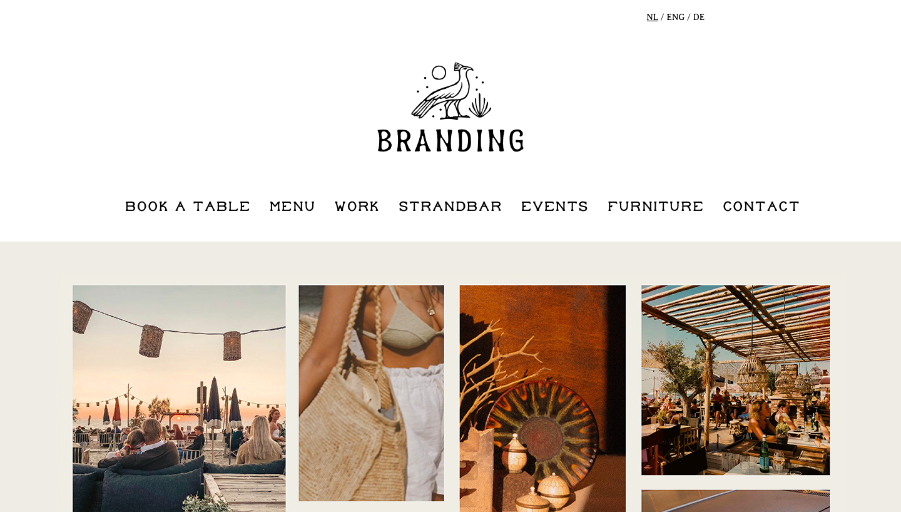

  #### Screenshot(s) van de tweede pagina (small screen):
  hier de naam van de pagina  workpage
  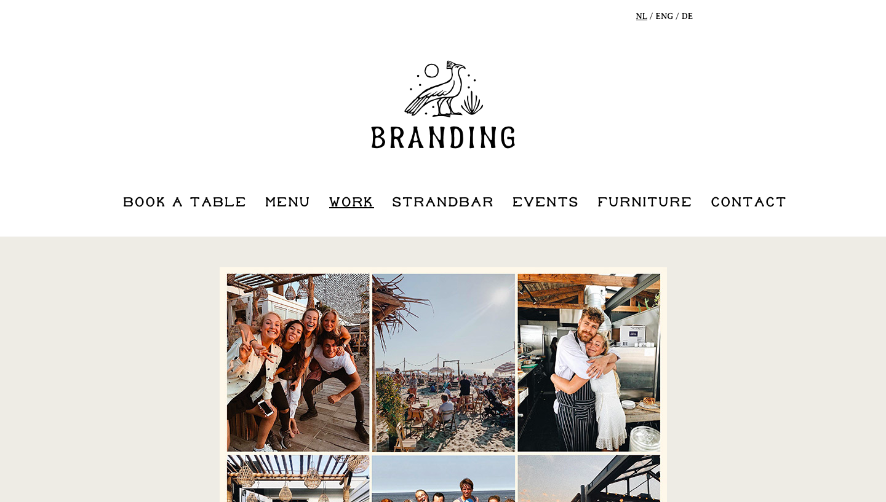
 

## Toegankelijkheidstest 1/2 (week 1)

  
uitwerken na test in 2e werkgroep

  ### Bevindingen
  Lijst met je bevindingen die in de test naar voren kwamen:

  1. heel veel div's worden er toegepast op de website, eigenlijk alleen maar. terwijl dat niet altijd handig is
  2. img hebben allemaal geen alt tekst dus er word niks omschreven tijdens het gebruiken van een voiceover
  3. er word geen gebruik gemaakt van list ellements
  4. word geen gebruik gemaakt van dark & light mode

## Breakdownschets (week 1)

  
uitwerken na afloop 3e werkgroep

  ### eerste pagina met alle breakdonws: 
  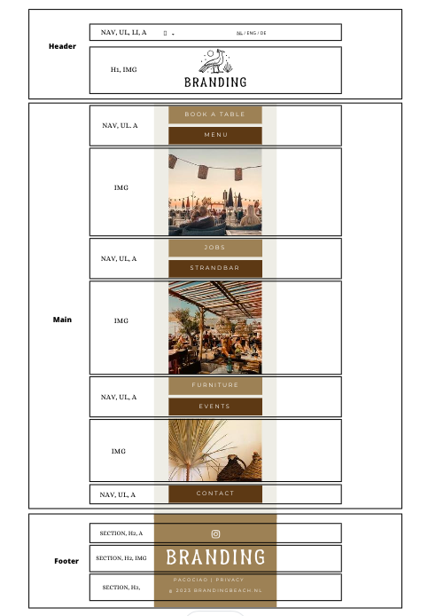

  ### tweede pagina alle breakdowns: 
  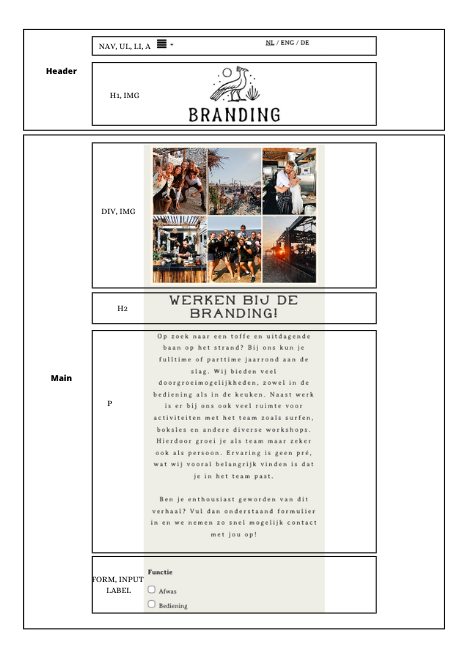
  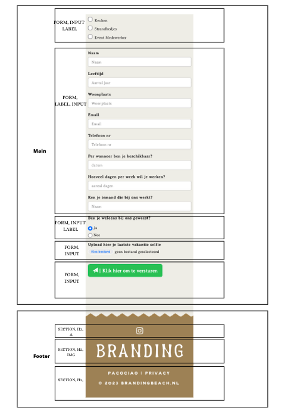

## Voortgang 1 (week 2)

  
uitwerken voor 1e voortgang

  ### Stand van zaken
  hier dit ging goed & dit was lastig (neem ook screenshots op van delen van je website en code)

  goed:
  1. opzet ging goed, begin maken ging ook goed
  2. afbeeldingen inporteren ging goed, alles goed verwoorden en aangegeven
  3. pagina's linken ging goed

  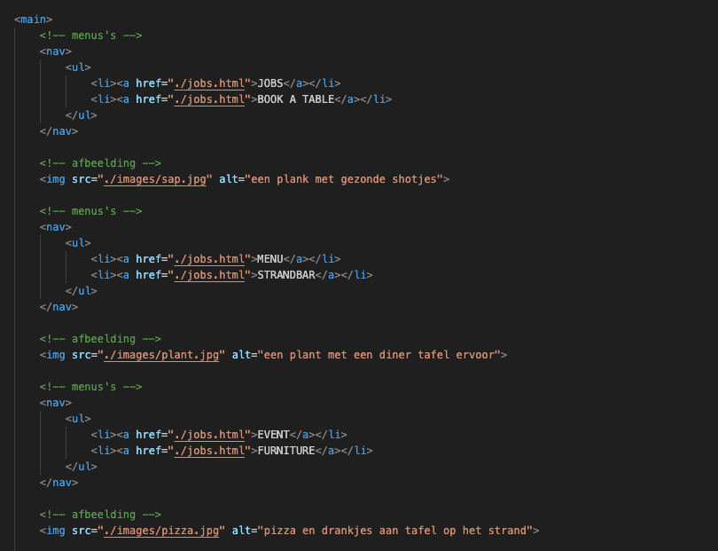
  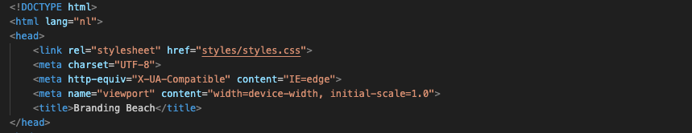

  lastig:
  1. even schakelen hoe alles nou ook alweer werkte
  2. footer centreren wilde niet mee werken
  3. javascript linken wist ik even niet meer
  4. een afbeelding over het hele scherm schalen was even priegelen, maar uiteindelijk gelukt.
  5. ik wist niet meer hoe je iets op een bepaalde plek centreerde, struggelde er mee dat ik iets rechts boven wilde maar even niet ging

  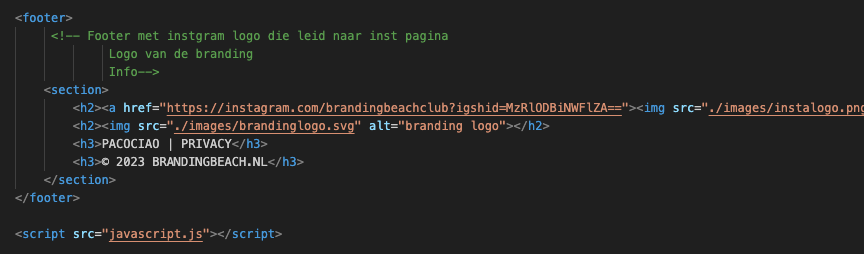
  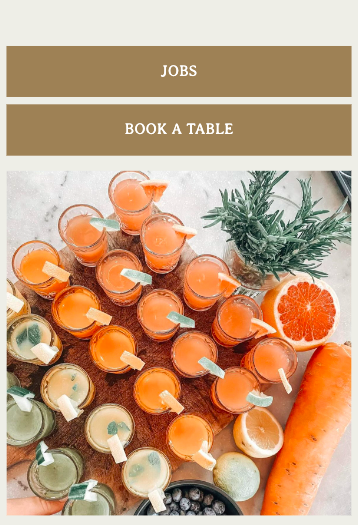
  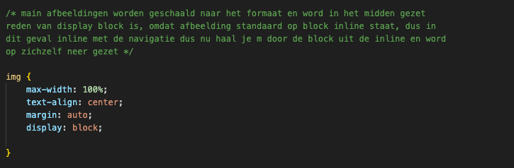

  ### Agenda voor meeting
  samen met je groepje opstellen

  student 1 | "Misschien een paar onderwerpen zoals Grid, dat we elkaar aanvullen en helpen met vragen"

  student 2 | "Jaa misschien inderdaad over grid praten, kijken waar we het zouden toe kunnen passen in ons ontwerp"
  
  student 3 | "En bijv flexbox"

  ### Verslag van meeting
  hier na afloop snel de uitkomsten van de meeting vastleggen

  - iedereen heeft met de studentassisten zijn html en css laten zien en doorgenomen
  - iedereen kon zijn vraag stellen, het ging bij ons eigenlijk per persoon. de een had een vraag over flexbos en de ander over grid
  - grid was goed uitgelegd wat nou het principe was
  - iemand had ook nog een vraag over flexbox, die vraag kon ook beantwoord worden, even weer een opfrisser

## Voortgang 2 (week 3)

  
uitwerken voor 2e voortgang

  ### Stand van zaken
  hier dit ging goed & dit was lastig (neem ook screenshots op van delen van je website en code)

  goed:
  1. alles de juiste plek geven
  2. opzet footer 
  3. home pagina afgemaakt en alles op de juiste plek gezet
  4. 2e pagina een opzet van gemaakt door de content erin te zetten

  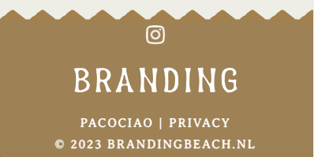
  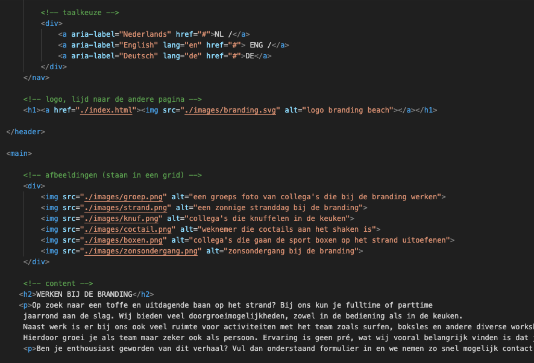

  lastig:
  1. ik vond het maken van een formulier nog wel lastig 
  2. hover was iets wat ik nog nooit had toegepast
  3. grid toepassen in mijn ontwerp moest ik even uitvogelen hoe dat werkte. uiteindelijk is het gelukt en heb iker zelfs een animatie aan toegevoegd die ik nog kene van vledejaar

  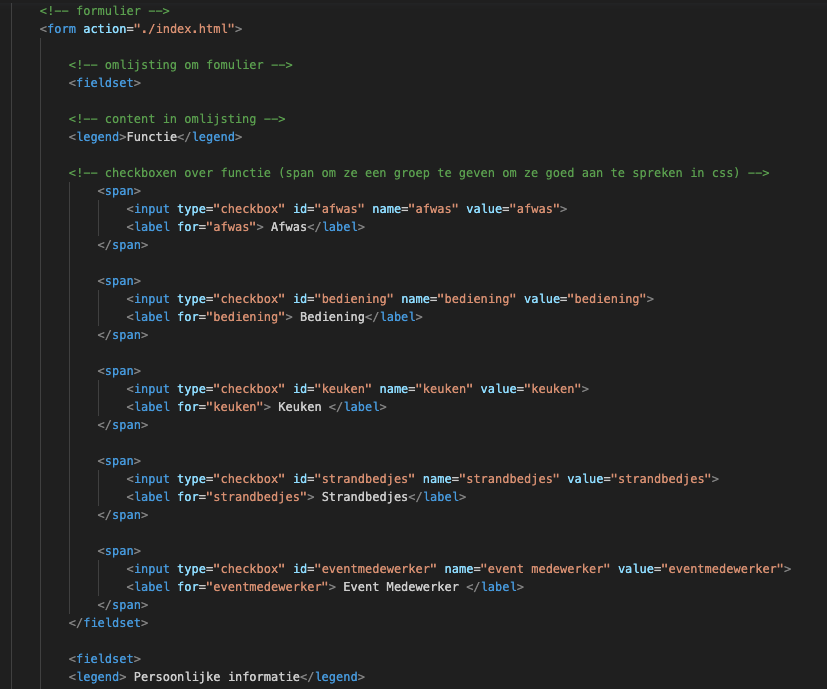
  
  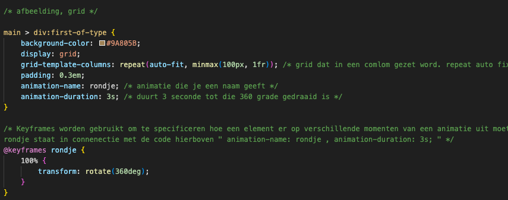

## Toegankelijkheidstest 2/2 (week 4)

  
uitwerken na test in 9e werkgroep

  ### Bevindingen
  Lijst met je bevindingen die in de test naar voren kwamen (geef ook aan wat er verbeterd is):

  1. alles ziet er keurig uit
  2. er was geen @media quaryas gebruikt (inmiddels wel)
  3. voiceover deed het goed, alles las die voor, alle img hadden een alt
  4. er is een dark& light modes ingesteld
  5. amper gebruik gemaakt van div, alleen bij daar waar nodig is voor de vormgeving
  6. de dingen die in een list item gezet moesten worden , staan daar ook in.

## Voortgang 3 (week 4)

  
uitwerken voor 3e voortgang

  ### Stand van zaken
  hier dit ging goed & dit was lastig (neem ook screenshots op van delen van je website en code)

  goed:
  1. het formulier goed positioneren
  2. alles in een fieldset zetten
  3. footer opbouw en positioneren

  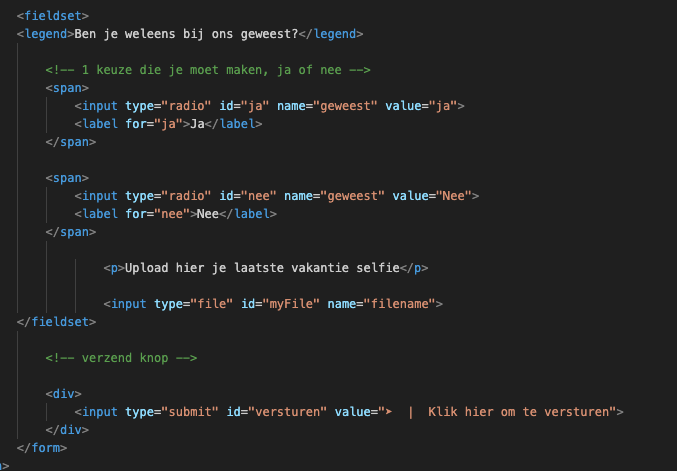
  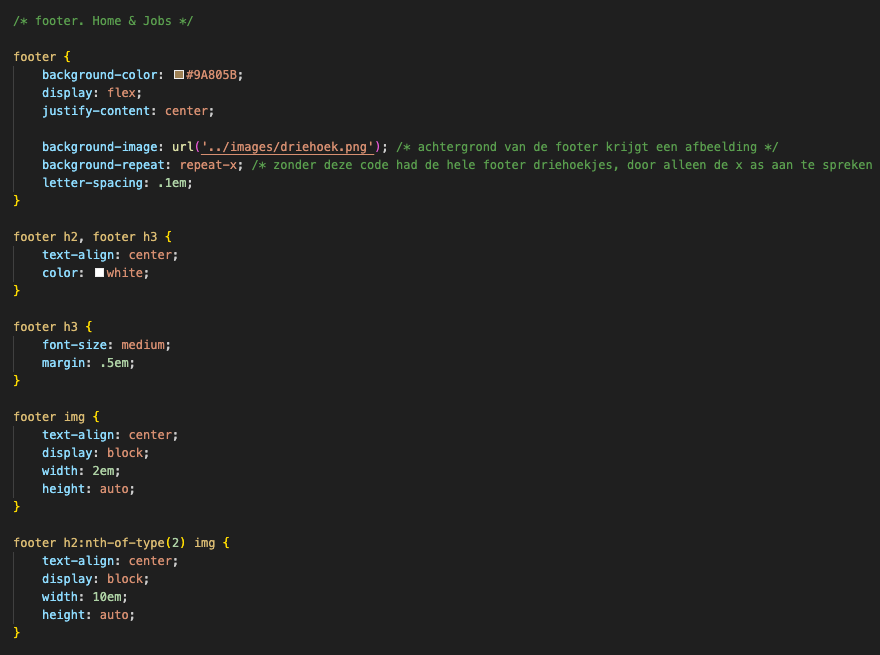
  

  lastig:
  1. het goed neerzetten van de checkboxen was even priegelen, ik wist niet hoe ik dat precies goed moest zetten met flexbox
  2. het juist neerzetten van het hamburger menu vond ik ook nog moeilijk, ook met het kruisje dat zoiu verschijnen als je op het hamburgermennu klikt
  3. button was ook even lastig omdat ik het nog nooit had gedaan maar het was uiteindelijk gelukt.

  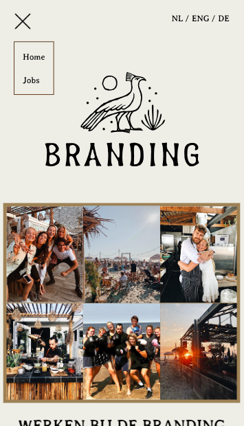
  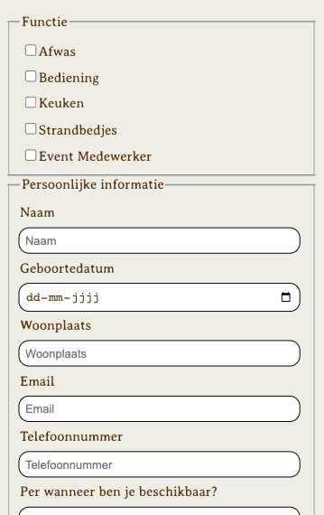
  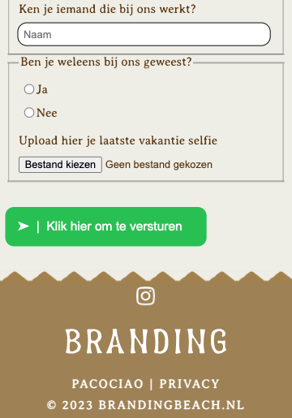
  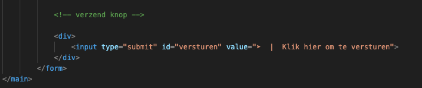
  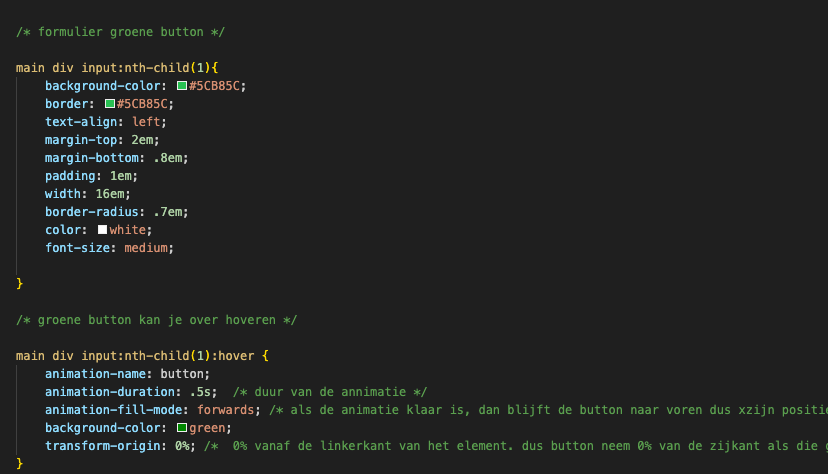

  ### Agenda voor meeting

  doordat het het laatste moment was om vragen te stellen aan de docent, had iedereen voor zichzelf vragen. hierbij mijn vragen:

  vraag 1 | " ik snapte niet waar mijn error's vandaan kwamen, want had het idee dat alles goed was"

  vraag 2 | "ik wil dus bij mijn fomulier een valid, maar heb geen idee eigenlijk hoe dat moet"

  ### Verslag van meeting
  hier na afloop snel de uitkomsten van de meeting vastleggen

  - error's kwamen doordat de type en de id niet overeen kwamen met elkaar. die moesten hezelfde zijn
  - error kwam ook doordat ik in een input=type een "date" bijvoorbeeld had staan en een placeholder, maar die twee codes gaan niet met elkaar
  - door input valid toe te passen in css komt er dus een groene rand om mijn tekstvlak in mijn formulier
  - en door required in html te zetten, achter het label snapt de valid dat daar omheen een groene rand moet komen

## Eindgesprek (week 5)

  
uitwerken voor eindgesprek

  ### Je uitkomst - karakteristiek screenshots:
  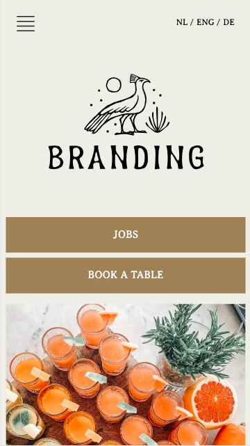
  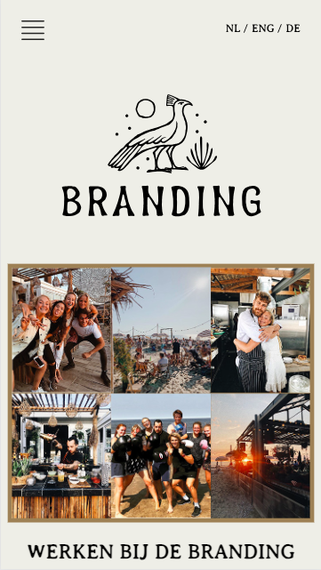

  ### Dit ging goed/Heb ik geleerd: 
  ik heb oprecht de afgelopen tijd mega veel geleerd bij het vak fed, aan het begin had ik me echt niet kunnen bedenken dat ik twee pagina's zou maken die er voor mijn doen goed uit zien. wellicht vind de een het een beetje karig, maar als ik kijk naar mijn niveau vind ik dat ik trots op mij zelf mag zijn. Wat ook goed is gegaan is voornamelijk goed is gegaan is de basis en opzet van  mijn pagina's 
  er staa goede codes in en mijn html ziet er netjes uit. ik heb ook onweijs veel geleerd, ik ben meer gaan nadenken bij het doen. als een code het niet doet, dan probeer ik wel een andere en daarmee spelen is heel erg goed en daarmee kom je ook ergens.

  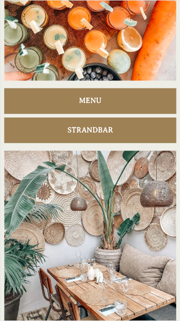
  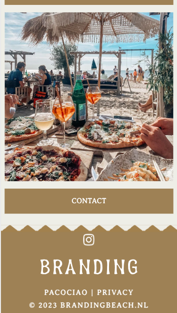

  ### Dit was lastig/Is niet gelukt:
  Ik vond het maken van een hamburgermenu, button en een formulier wel lastig, ik wist toen ik er aan begon echt niet waar ik zou moeten beginnen. met een beetje hulp van de studenten assistent en een beetje proberen en google is het mij uiteindelijk wel geluk. en daar ben ik heel blij mee. Alles wat ik wilde verwerken in mijn ontwerp is mij ook wel gelukt. dingen waarvan ik echt zeker weet dat ik het niet kan, ben ik ook niet aan begonnen. want hoe leuk het ook is om extra dingen toe te passen is het wel handig om de code te begrijpen. en om zo maar dingen van het internet te pakken en te plakken in mijn code vind ik niet handig en bereik ik eigenlijk niks mee. 

  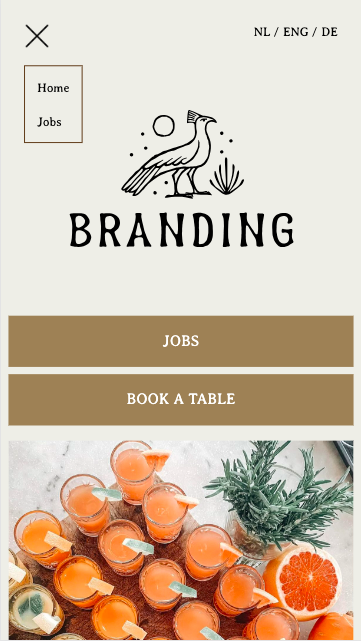
  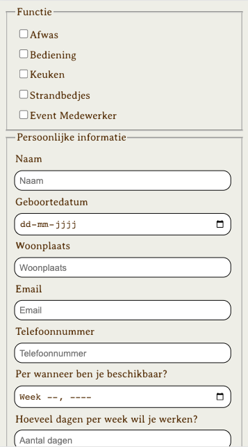
  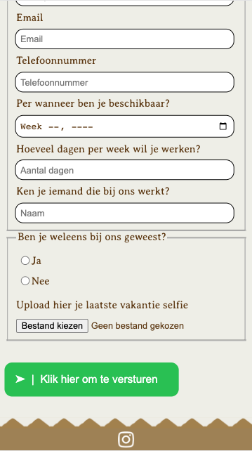

## Bronnenlijst

  
continu bijhouden terwijl je werkt

  Nb. Wees specifiek ('css-tricks' als bron is bijv. niet specifiek genoeg). 
  Nb. ChatGpT en andere AI horen er ook bij.
  Nb. Vermeld de bronnen ook in je code.

  1. https://codepen.io/joostf/pen/VKyPxZ?editors=1100
  2. https://www.w3schools.com/html/html_forms.aspb
  3. https://www.w3schools.com/tags/att_input_type_checkbox.asp
  4. https://www.w3schools.com/tags/att_input_type_radio.asp
  5. https://www.w3schools.com/html/html_form_input_types.asp
  6. https://www.w3schools.com/cssref/sel_hover.php
  7. https://www.w3schools.com/cssref/tryit.php?filename=trycss_anim_transform
  8. https://www.codecenter.nl/pr/tutorial/html/aflinks#:~:text=Het%20creëren%20van%20een%20afbeelding,manier%20als%20een%20tekst%20link.
  9. https://www.onlinewebfonts.com/download/f104f2c9908b2ee6bf57e22e02f176ba
  10. https://www.brandingbeach.nl/nl/

